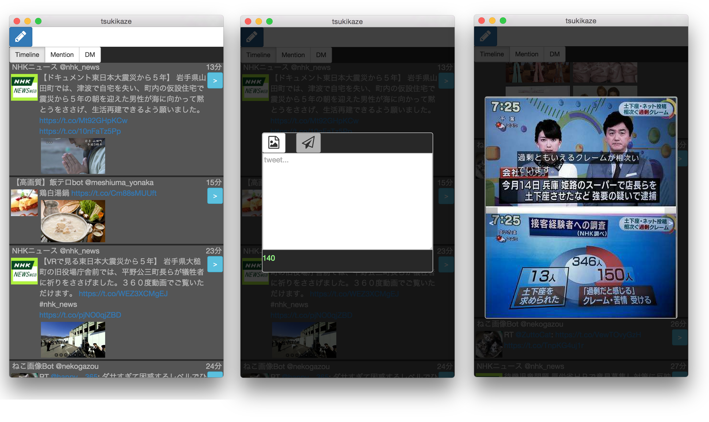

# tsukikaze
Twitter client for desktop. This app is developed by Electron. 

## screenshots


## download
[v0.0.5](https://github.com/sabazusi/tsukikaze/releases/tag/0.0.5)

## development
```bash
# setup
npm install

# compile
npm compile

# run with gulp-watch
npm start

# run eslint
npm run lint

# packaging
npm run package
```
